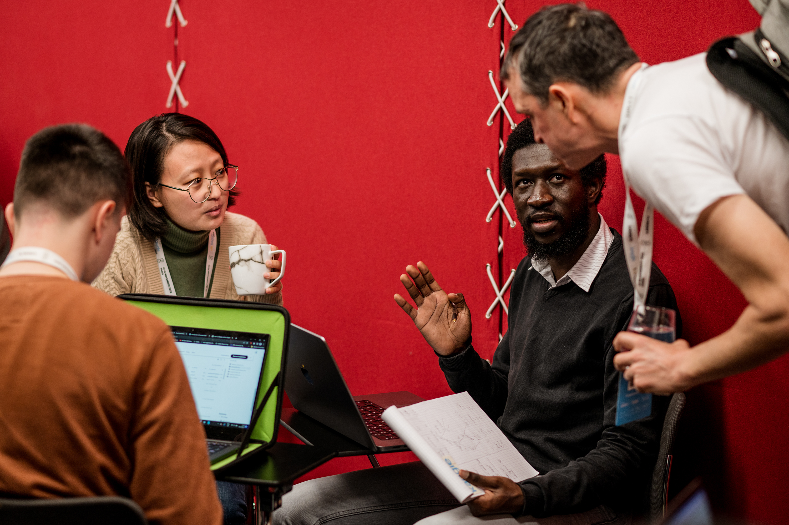

# Ismaila Seck, PhD 
email: ismaila@lengo.ai

## Recent activities
- Aside from my research on Automatic Speech Recognition, I launched a reading group to gather members of GalsenAI that are interested in the research part of Deep Learning model, and offer researchers a space to communicate and discuss around subjects that interest them . GalsenAI is in my opinion the most active AI Association in Senegal. You can find a video of our first session  [here](https://youtu.be/-VOG2esUc6I).

## my year 2022

As a lecturer/researcher: 
- I joined African Institute for Mathematical Sciences (AIMS) and the African Master of Machine Intelligence as Post-doctoral Researcher. 

- I gave a lecture on Image Processing and Computer Vision at Université virtuelle du Sénégal (UVS). 

- I was a speaker at the IndabaX Senegal where I talked about adversarial examples. 

As an ML/DL enthusiast who enjoys interacting with other enthusiasts: 
- I participated to the Kaggle Days , my first in-person since the pre-covid era. The learning experience was amazing, plus I had the opportunity to attend talks from and speak with some Kaggle Grand Masters. 

- I also served as a mentor for the ML Study Jam organized by GalsenAI to help people learn more about Machine Learning/Deep Learning. 

- I have been granted NVIDIA Deep Learning Institute Ambassadorship, that is a great step for my goal of making Deep Learning accessible to more people. 

- I contributed to the translation of the Hugging Face course from English to French. My first contribution to open-source project, the first of many more I hope. 

[Find the original post on linkedin](https://www.linkedin.com/posts/ismailaseck_research-machinelearning-deeplearning-activity-7019578031014846464-Aipn?utm_source=share&utm_medium=member_desktop)

## Work Experience

#### Post-Doctoral Researcher 
AIMS-AMMI (African Institute for Mathematical Sciences-African Master of Machine Intelligence)   
2022-Now

#### Teaching
- Image Processing and Computer Vision, Senegalese Virtual University, 2021-2022
- **Supervised Learning**, Senegalese Virtual University (UVS), 2019-2021
- (Random) Signal Processing, INSA de Rouen, 2019-2020
- Numerical Analysis, INSA de Rouen, 2018-2019
- Remedial Courses in Mathematics, INSA de Rouen, 2018-2019
- **Machine Learning**, Polytech Clermont-Ferrand, 2017-2018
- Probability and Statistics, Polytech Clermont-Ferrand, 2017-2018

## Publications
- Seck, Ismaïla, Gaëlle Loosli and Stéphane Canu. 
"Linear Program Powered Attack",
IJCNN-International Joint Conference on Neural Networks, 2021.

- Seck, Ismaïla, Gaëlle Loosli, and Stephane Canu.
"L1-norm double backpropagation adversarial defense."
ESANN-European Symposium on Artificial Neural Networks,
Computational Intelligence and Machine Learning, 2019.

## Education

#### PhD in Computer Science 
 INSA Rouen Normandie;
 2017-2021;
 Rouen, Normandy, France
 
#### Maths and Modeling Engineering
 Polytech Clermont-Ferrand; 
 2014-2017;
 Clermont-Ferrand, Auvergne-Rhône-Alpes, France
 
#### Research Master's Degree in Computer Science
 University Clermont-Auvergne (UCA);
 2016-2017;
 Clermont-Ferrand, Auvergne-Rhône-Alpes, France
 
#### Preparatory Classes for the Grandes Ecoles
CPC ESMT-ESIGELEC;
2012-2014;
Dakar, Senegal

